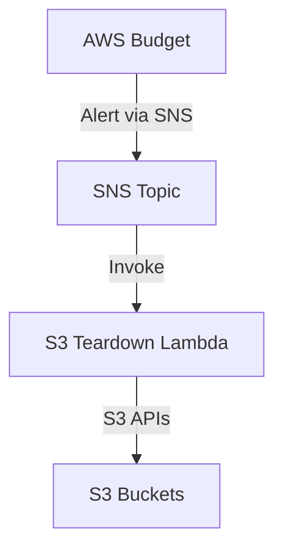

# Budget Teardown Service

> 💡 Automatically tears down publicly accessible AWS resources (e.g., S3 buckets) when an AWS Budget threshold is exceeded. This project uses a Makefile-driven flow plus a build script and CloudFormation to deploy:

1. Build and package each service (Lambda) with dependencies.
2. Upload artifacts under unique keys to a premade S3 bucket.
3. Deploy/update a single CloudFormation stack that wires AWS Budget → SNS → Lambda for teardown actions.

---

## Architecture



- **AWS Budget**: Monitors monthly cost; when usage exceeds the threshold, it publishes to an SNS Topic.
- **SNS Topic**: Receives budget alerts and invokes one or more Lambda functions.
- **S3 Teardown Lambda**: Parses the SNS event, examines S3 buckets tagged `access=public`, and for each, blocks public access and removes website configuration.
- **CloudFormation**: Defines IAM role, SNS topic, Budget with SNS subscriber, Lambda functions, SNS subscriptions, and applies tags.

---

## Prerequisites

- **AWS CLI** configured with credentials and default region.
- **Deployment S3 Bucket** (e.g., `organization-deployment-artifacts`) exists. Purges artifacts after the stack updates.

- **Local tools**:
  - `uv` for Python dependency management (pyproject.toml-based).
  - `bash`, `zip`, `python3`, and `pip` available for build scripts.
- **GNU Make** to run provided targets.

---

## Project Structure

```
.
├── infrastructure/
│   └── budget-teardown-service.yaml    # CloudFormation template
├── scripts/
│   └── build.sh                        # Packages a service into build/<service>.zip
├── services/
│   └── s3_teardown_lambda/
│       ├── pyproject.toml             # Lambda package metadata & dependencies
│       └── s3_teardown_lambda/        # Python module folder
│           ├── __init__.py
│           └── main.py                # Handler: lambda_handler(event, context)
├── build/                              # Generated by build script (not checked in)
│   └── s3_teardown_lambda.zip         # Example built artifact
├── Makefile                            # Orchestrates sync, test, build, upload, deploy
├── pyproject.toml                      # Root project dependencies (if any)
└── README.md                           # This file
```

---

## Setup

1. **Configure AWS CLI**:

   ```bash
   aws configure
   # Ensure default region matches or export AWS_REGION in your shell.
   ```

2. **Ensure deployment bucket exists** and configure lifecycle rules (or versioning + lifecycle) to expire old artifacts:

3. **Make build script executable**:

   ```bash
   chmod +x scripts/build.sh
   ```

4. **Install project dev dependencies** (if any):

   ```bash
   make sync
   make install
   ```

---

## Usage

Set or export variables, or adjust defaults at top of Makefile:

- `AWS_BUCKET` – your S3 bucket for artifacts.
- `AWS_STACK` – CloudFormation stack name (default: `budget-teardown-service`).
- `AWS_REGION` – AWS region (default: `us-east-1`).
- `BUDGET_LIMIT`, `BUDGET_THRESHOLD` – budget amount (USD) and threshold (%) for alerts.
- (Optionally) `ProjectTag`, `AccessTag` if you override tag values.

### 1. Build & Deploy

From repo root:

```bash
make deploy
```

This runs:

1. **package-all**: For each directory under `services/`, runs `scripts/build.sh <service>`, producing `build/<service>.zip`.
2. **upload-all**: For each service, uploads `build/<service>.zip` to S3 under a unique key (e.g., `<service>-20250620T123456.zip`) and collects CloudFormation parameter overrides.
3. **do-deploy_internal**: Invokes `aws cloudformation deploy` with:
   - `DeploymentArtifactsBucket=$(AWS_BUCKET)`
   - per-Lambda `S3Key` parameters set to the new artifact key
   - `BudgetLimit`, `BudgetThresholdPercentage`, `ProjectTag`, `AccessTag`
     CloudFormation then creates or updates the stack. Because the S3Key differs, Lambda functions’ code is updated.

### 2. Testing

Run unit tests locally (with Moto mocks):

```bash
make test
```

### 3. Cleaning

- **Build artifacts**:

  ```bash
  make clean
  ```

- **Purge S3 artifacts** (after you no longer need old zips):

  ```bash
  aws s3 rm s3://organization-deployment-artifacts --recursive
  ```

  Or rely on lifecycle rules for automated expiry.

### 4. Redeploy

Whenever code changes:

```bash
make deploy
```

This packages new code, uploads under a new key, and updates the stack.

---

## scripts/build.sh

Usage:

```bash
./scripts/build.sh <service_name>
```

- Cleans/creates `build/<service_name>/`.
- Uses `uv pip install --target build/<service_name> services/<service_name>` so dependencies (from pyproject.toml) and your module code are placed in the folder.
- Zips contents into `build/<service_name>.zip`.

Ensure your Lambda handler matches the module path, e.g. for `s3_teardown_lambda`, handler in CloudFormation is `s3_teardown_lambda.main.lambda_handler`.

---

## CloudFormation Template Highlights

- **Parameters**:
  - `DeploymentArtifactsBucket` (String): S3 bucket name.
  - For each Lambda service, a parameter `<ServiceCamelCase>S3Key` (String): the artifact key uploaded by Makefile.
  - `BudgetLimit`, `BudgetThresholdPercentage`, `ProjectTag`, `AccessTag`.
- **Resources**:
  - IAM Role (`LambdaExecutionRole`) with CloudWatch Logs and S3 permissions.
  - SNS Topic (`BudgetSNSTopic`).
  - AWS Budgets resource, notifying the SNS Topic when threshold exceeded.
  - Lambda function resources referencing `Code: S3Bucket` and parameterized `S3Key`.
  - SNS subscription and Lambda permission to allow SNS to invoke the Lambda.
- **Tags**: All resources tagged with `project`, `access`, and `awsApplication`.

---

## Environment Variables & Overrides

You can override Makefile defaults via environment:

```bash
export AWS_BUCKET=my-deploy-bucket
export AWS_STACK=my-budget-stack
export AWS_REGION=us-west-2
export BUDGET_LIMIT=50
export BUDGET_THRESHOLD=75
export ProjectTag=my-project
export AccessTag=private
make deploy
```

Or edit the top of the Makefile.

---

## Extending for Multiple Services

- Add additional folders under `services/`, each with its own pyproject.toml and module code.
- In CloudFormation template, add parameters for each service’s S3Key (e.g., `AnotherServiceS3Key`) and reference them in its Lambda resource.
- The Makefile loop auto-detects all directories under `services/` and uploads each zip under a git hashed key, adding parameter overrides for each.

---

## Summary

This project provides:

- A Makefile-driven workflow for building, uploading, and deploying multiple Lambda services.
- A `build.sh` that packages each service (with dependencies) into a ZIP for Lambda.
- CloudFormation template parameterized to accept S3 keys for each Lambda, so deploying new code is as simple as uploading under a new key and passing it in.
- AWS Budget → SNS → Lambda wiring to automatically tear down publicly accessible resources when budget thresholds are exceeded.
- Cleanup guidance to keep S3 costs low.

```

```
